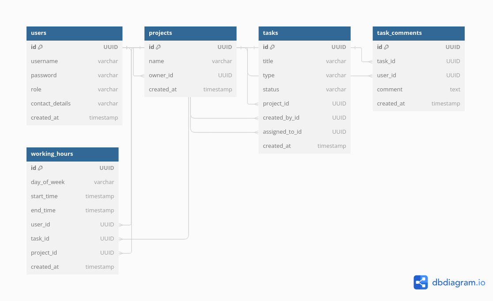

### Developers Guide
 - clone the repository
 - install  apache-maven-3.8.6
 - run this command in project directory in your device
   ```
     mvn clean package liberty:dev -Popenliberty
   Users:
username: admin_user Pass: admin_password, Username: customer_user Pass: customer_password, Username: employee_user Pass: employee_password,

### Help Desk Application Project Report

#### 1. Introduction

The Help Desk application is developed for a software development company to manage customer requests for bug reports, enhancements, version upgrades, and project/task tracking. This system helps the company estimate the efforts spent on a particular customer request and provides an organized way to handle various user roles and their associated functionalities.

#### 2. Project Discussion

##### Objective

The main objective is to create a Help Desk application that can:
- Manage customer requests efficiently.
- Track projects and tasks assigned to employees.
- Estimate and record efforts in man-hours.
- Provide role-based access and functionalities.

##### Users and Roles

The system includes four categories of users:
1. **Administrator**: Manages setup definitions, projects, users, task types, and generates reports.
2. **Customer Users**: Can create, view, and approve/reject tasks related to their projects.
3. **Employees**: Can access all projects, create and manage tasks, and report working hours.
4. **System**: To integrate and provide web service for B2B communication.

##### Functional Requirements

1. **Task Management**:
    - Create, update, and view tasks.
    - Change task status: New, In Progress, Completed, Approved, Rejected.
    - Add comments to tasks during status changes.

2. **Project Management**:
    - Create, update, and view projects.
    - Assign tasks to projects.

3. **User Management**:
    - Create, update, and view user details.
    - Assign roles to users.

4. **Time Tracking**:
    - Record daily working hours on tasks.
    - Generate reports on working hours per project and per employee.

5. **Web Service Integration**:
    - Provide a RESTful or SOAP web service to return tasks for a customer based on user credentials.

##### Non-Functional Requirements

1. **Scalability**: The system should handle a growing number of users and tasks without performance degradation.
2. **Security**: Ensure secure access through authentication and role-based authorization.
3. **Usability**: Provide a user-friendly interface with clear navigation and functionality.
4. **Maintainability**: Use design patterns and best practices for easy maintenance and future enhancements.

##### Technology Stack

- **Frontend**: JavaServer Faces (JSF)
- **Backend**: Enterprise Beans for business logic
- **Persistence**: Java Persistence API (JPA)
- **Web Service**: REST 
- **Database**: JPA Mysql
#### 3. Database ER Diagram



### Project Documentation

**1. Introduction:**

The Help Desk application is designed to manage customer requests, track employee tasks, and estimate project efforts. It addresses the challenges faced by the company in handling bug reports, enhancements, version upgrades, and daily task tracking.

**2. Project Architecture:**

- **Frontend:** JavaServer Faces (JSF)
- **Backend:** Enterprise JavaBeans (EJB)
- **Database:** Java Persistence API (JPA)
- **Web Service:** RESTful API
- **UI Components:** PrimeFaces

**3. Detailed Functionality:**

**3.1 User Roles and Permissions:**

- **Administrator:**
   - Setup and manage projects
   - CRUD operations on users (both customer users and employees)
   - Define and update task types
   - Generate reports on working hours and project efforts

- **Customer Users:**
   - View and manage tasks related to their projects
   - Create new tasks
   - Approve or reject completed tasks with comments

- **Employees:**
   - Access and manage all tasks and projects
   - Create new tasks
   - Update task status from New to In Progress to Completed
   - Log daily working hours on tasks

**3.2 Task Management:**

- **Task States:**
   - New: Initial state when a task is created
   - In Progress: Set by employees when work begins on the task
   - Completed: Set by employees upon task completion
   - Approved/Rejected: Set by customer users based on task review

- **Task Types:**
   - Bug
   - Enhancement
   - Upgrade

**3.3 Time Tracking:**

- Employees log their daily working hours on tasks.
- Time tracking helps in estimating project efforts and productivity.

**3.4 Web Service Integration:**

- REST API for B2B integration with customer ERP systems.
- API endpoint to return tasks, status, and total hours worked based on user credentials.

**4. Database Schema:**

**4.1 Entities:**

- **User:**
   - ID (UUID)
   - Username
   - Password
   - Role (Administrator, Customer User, Employee)
   - Contact Details

- **Project:**
   - ID (UUID)
   - Name
   - Owner (User)

- **Task:**
   - ID (UUID)
   - Title
   - Description
   - Status (New, In Progress, Completed)
   - Type (Bug, Enhancement, Upgrade)
   - AssignedTo (User)
   - CreatedBy (User)
   - Project (Project)

- **WorkingHour:**
   - ID (UUID)
   - StartTime
   - EndTime
   - DayOfWeek
   - User (User)
   - Task (Task)
   - Project (Project)

- **Task Comment:**
   - ID (UUID)
   - User (User)
   - Task (Task)
   - Comment 


**4.2 Relationships:**

- A `Project` is owned by a `User`.
- A `Task` is associated with a `Project`.
- A `Task` can be assigned to and created by a `User`.
- `WorkingHour` logs are linked to `User`, `Task`, and `Project`.

**5. Implementation Details:**

**5.1 JSF Pages:**

- **Login Page:**
   - Username and password fields
   - Login button

- **Dashboard:**
   - Welcomes user after Login is success with message
  
- **Registration:**
   - Admin can create users.
  
- **Task Management:**
   - List of tasks with options to create, edit, and delete tasks
   - Form to update task details and status

- **Project Management:**
   - List of projects with options to create, edit, and delete projects
   - Form to update project details

- **Working:**
   - Employee log their worked hour on task.
  
- **Profile:**
   - Login user can update their contact Details.

**5.2 EJB Business Logic:**

- **User Management:**
   - CRUD operations on users
   - Role-based access control

- **Project Management:**
   - CRUD operations on projects
   - Link projects to customer users

- **Task Management:**
   - CRUD operations on tasks
   - Status updates and logging comments

- **Time Tracking:**
   - Logging working hours on tasks

- **Reporting:**
   - Generate reports on working hours for employees and projects

**6. RESTful Web Service:**

**6.1 API Endpoint:**

- **URL:** `demo/api/tasks/user-tasks`
- **Method:** POST
- **Request Body:**
  ```json
  {
      "username": "customer_user",
      "password": "customer_password"
  }
  ```
- **Response:**
  ```json
  [
      {
          "taskTitle": "Fix Login Bug",
          "taskStatus": "In Progress",
          "totalHoursWorked": 5
      },
      ...
  ]
  ```

**6.2 Security:**

- Basic authentication using username and password.
- Validation of user credentials against the database.

**7. Project Discussion:**

The development of the Help Desk application was guided by the need to improve customer request management and task tracking. The project went through several phases:

- **Requirements Gathering:** Engaged with stakeholders to define the scope and requirements.
- **Design:** Created wireframes and ER diagrams to visualize the application structure.
- **Development:** Implemented the application using JSF, EJB, and JPA. Regular iterations and feedback loops ensured continuous improvement.
- **Testing:** Conducted thorough testing to identify and fix bugs.
- **Deployment:** Deployed the application on a server and provided documentation for end-users and administrators.
- **Maintenance:** Ongoing support and updates based on user feedback and new requirements.

**8. Conclusion:**

The Help Desk application provides a robust solution for managing customer requests, tracking employee tasks, and estimating project efforts. With its user-friendly interface and comprehensive functionality, it enhances productivity and customer satisfaction.

**Appendices:**

- **Appendix A: User Manual**
   - Step-by-step guide for using the application

- **Appendix B: Developer Guide**
   - Detailed instructions for setting up the development environment
   - Code structure and module descriptions

- **Appendix C: ER Diagram**
   - Visual representation of the database schema
